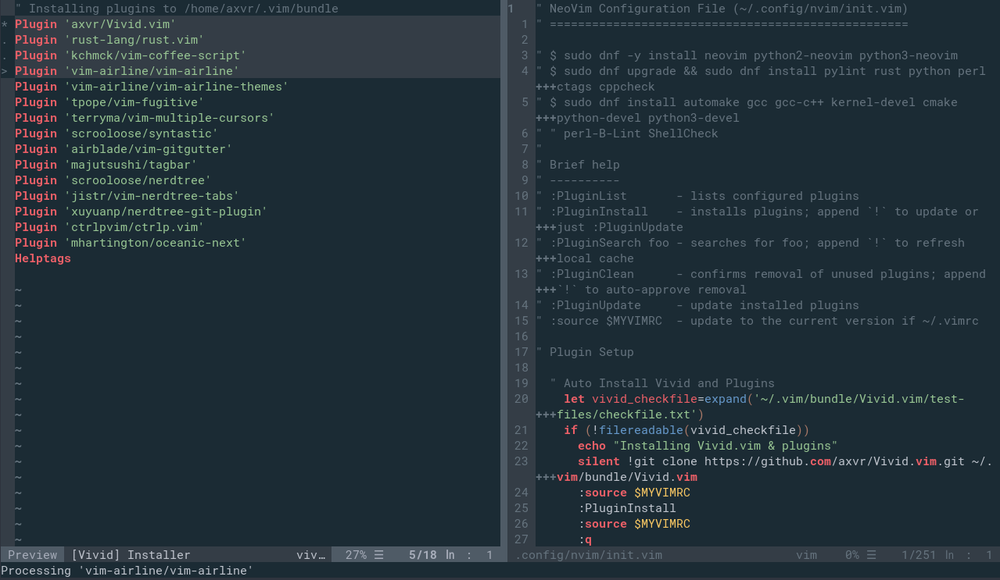

# Vivid-Legacy.vim

**Vivid is the Next-Gen Vim Package Manager**

<!-- Badges made using https://shields.io/ -->
[](https://github.com/VividVim/Vivid-Legacy.vim/releases)
[](https://github.com/VividVim/Vivid-Legacy.vim/blob/master/LICENCE)

Vivid is a fork of the Vundle Vim Plugin manager. Vivid aims to extend the
features of Vundle, to make the most powerful Plugin manager, possible.
Vivid's main goal is to become fully cross platform, so that it can work as
expected on all systems and Vim derivatives, including Neovim and Windows.

If you find any bugs or errors, please feel free to submit an issue as I cannot test Vivid on every possible system for problems. I would in the future like to add multi-language support to Vivid, help would be greatly appreciated, especially since Google Translate is not entirely accurate a lot of the time. For more information on contributing to Vivid see the [contributing document](https://github.com/VividVim/Vivid-Legacy.vim/blob/master/CONTRIBUTING.md) and ensure that you read and agree to the [Code of Conduct](https://github.com/VividVim/Vivid-Legacy.vim/blob/master/CODE_OF_CONDUCT.md).

## About

[Vivid] allows you to...

* Configure your plugins right in your ``~/.vimrc``
* Install configured plugins (a.k.a. scripts/bundle)
* Update configured plugins
* Search by name all available [Vim scripts]
* Clean unused plugins up
* Run the above actions in a *single keypress* with interactive mode

[Vivid] automatically...

* manages the [runtime path] of your installed scripts
* regenerates [help tags] after installing and updating



## Quick Start

1. Vivid requires that [Git] and Curl are installed on your system


2. Put this at the top of your ``~/.vimrc`` to use Vivid. Remove plugins you don't need (some of them will not work), they are for illustration purposes. It does not have to be stricly at the top, but if it isn't, then Vim will give errors and will take longer to open.

    ```vim
    " Example Vim Config File (~/.vimrc)
    " ==================================

    " Brief help
    " ----------
    " :PluginList       - Lists all configured plugins
    " :PluginUpdate     - Update all plugins to latest versions
    " :PluginInstall    - Installs plugins; append `!` to update or just :PluginUpdate
    " :PluginSearch foo - Searches for foo; append `!` to refresh local cache
    " :PluginClean      - Remove unused plugins; append `!` to auto-approve removal
    " :help vivid       - View documentation from within Vim

    set nocompatible    " Remove Vi backwards compatibility
    syntax on           " Enable syntax highlighting
    filetype off        " Temporarily disable the 'filetype' setting

    " Auto Install Vivid and Plugins
    let vivid_checkfile=expand('~/.vim/bundle/Vivid-Legacy.vim/test-files/checkfile.txt')
    if (!filereadable(vivid_checkfile))
      echo "Installing Vivid.vim & plugins"
      silent !git clone https://github.com/VividVim/Vivid-Legacy.vim.git ~/.vim/bundle/Vivid.vim
      :source $MYVIMRC
      :PluginInstall
      :source $MYVIMRC
      :q
    endif

    set rtp+=~/.vim/bundle/Vivid-Legacy.vim/ " Append Vivid to the runtimepath
    call vivid#open()
    " Input Plugins Below this Line

      Plugin 'VividVim/Vivid-Legacy.vim' " let Vivid manage Vivid (Do not remove)

      " The following are examples of different formats supported.
      "Plugin 'tpope/vim-fugitive' " Plugin from GitHub
      "Plugin 'git://git.wincent.com/command-t.git' " Git plugin not on GitHub
      "Plugin 'file:///home/user/path/to/plugin' Local git plugins
      "Plugin 'rstacruz/sparkup', {'rtp': 'vim/'} " Plugin is in a GitHub subdirectory
      "Plugin 'ascenator/L9', {'name': 'newL9'} " Avoid naming confilics

    " Input Plugins Above this Line
    call vivid#close()
    filetype plugin indent on   " Enable 'filetype' seting

    " Continue Vimrc after this line
    ```

    This VimL will install all plugins already in the ``~/.vimrc`` file automatically,
    when Vim is opened on a system which does not have Vivid.vim installed. This makes your
    ``~/.vimrc`` file more portable , for use on other systems.

    NOTE: To install plugins added after Vivid.vim is installed, see section 3:
    Install Plugins. Seen below.

    Shell Notes (If you don't know what this means, ignore this):

    * Bash works out of the box.
    * Zsh should work perfectly fine with Vivid.vim out of the box.
    * For those using the fish shell: add ``set shell=/bin/bash`` to the top of your ``~/.vimrc``.


3. Install Plugins:

    Launch ``vim`` and run ``:PluginInstall``

    To install from command line: ``vim +PluginInstall +qall``


4. Update Plugins:

    Launch ``vim`` and run ``:PluginUpdate``


See the [``:help vivid``](https://github.com/VividVim/Vivid-Legacy.vim/blob/master/doc/vivid.txt) Vimdoc for more details.

See the [changelog]


To all of the [Vundle contributors], and the [Vivid contributors],  **Thank you!**

* Vivid was developed and tested with [Vim] 8.0 on Linux
* Vundle was developed and tested with [Vim] 7.3 on OS X, Linux and Windows
* Vivid follows the [KISS] principle, with a few exceptions which make it more
  powerful than any other vim plugin manager.

## TODO:
[Vivid] is a fork of Vundle, this has resulted in it becoming a major work in progress.

* [x] Restructure repository
* [x] Restructure files
* [x] Rebrand Vundle fork to Vivid
* [x] Rename components
* [x] Remove redundant code
* [x] Improve human readability of source
* [ ] Add full Neovim support ([in progress])
* [ ] Replace and modernise the old Vundle base ([in progress])
* [ ] Speed up and optimise the plugin manager ([in progress])
* [ ] Fix the bugs in Vundle base
* [ ] Improve Windows support ([in progress])
* [ ] Add GitLab support (maybe add BitBucket support) ([in progress])
* [ ] Add update and install progress bar (for YCM especially)
* [ ] Add support for switching and testing between http:// git:// & https:// ([in progress])
* [ ] Add support for Mercurial repos ([in progress])
* [x] Increase security and mitigate MITM attacks
* [ ] Allow users to choose to update using latest commit or tag ([in progress])
* [x] Comment all of the code ([in progress])
* [ ] Improve documentation ([in progress])
* [x] Remove search for plugins
* [ ] Add multi-language support
* [x] Disconnect from Vundle upstream
* [ ] Fix plugin repo deletion bug where credentials are required ([in progress])
* [x] Make a Github 'organisation' for contributers to join & get commit access
* [x] Replace old README and vim help menu
* [x] Improve the test files from Vundle
* [x] Attempt to use ``https`` before ``http``
* [ ] Finish what Vundle set out to do:
  * [x] activate newly added bundles on `.vimrc` reload or after `:PluginInstall`
  * [x] use preview window for search results
  * [x] Vim documentation
  * [x] put Vundle in `bundles/` too (will fix Vundle help)
  * [x] tests
  * [x] improve error handling
  * [ ] allow specifying revision/version?
  * [ ] handle dependencies
  * [x] show description in search results (removed search feature)
  * [x] search by description as well (removed search feature)
  * [ ] make it rock!
* [ ] And many more things


[Vivid]:https://github.com/VividVim/Vivid-Legacy.vim/
[Vundle]:https://github.com/VundleVim/Vundle.vim/
[changelog]:https://github.com/VividVim/Vivid-Legacy.vim/blob/master/CHANGELOG.md/
[Vim]:http://www.vim.org
[Git]:http://git-scm.com
[``git clone``]:http://gitref.org/creating/#clone
[KISS]:https://wikipedia.org/wiki/KISS_principle
[Vim scripts]:http://vim-scripts.org/vim/scripts.html
[help tags]:http://vimdoc.sourceforge.net/htmldoc/helphelp.html#:helptags
[runtime path]:http://vimdoc.sourceforge.net/htmldoc/options.html#%27runtimepath%27
[Vundle contributors]:https://github.com/VundleVim/Vundle.vim/graphs/contributors
[Vivid contributors]:https://github.com/VividVim/Vivid-Legacy.vim/graphs/contributors
[in progress]:https://github.com/VividVim/Vivid.vim/

<!--
  Old Vundle Vimrc Example:
   ```vim
   set nocompatible              " be iMproved, required
   filetype off                  " required

   " set the runtime path to include Vundle and initialize
   set rtp+=~/.vim/bundle/Vundle.vim
   call vundle#begin()
   " alternatively, pass a path where Vundle should install plugins
   "call vundle#begin('~/some/path/here')

   " let Vundle manage Vundle, required
   Plugin 'VundleVim/Vundle.vim'

   " The following are examples of different formats supported.
   " Keep Plugin commands between vundle#begin/end.
   " plugin on GitHub repo
   Plugin 'tpope/vim-fugitive'
   " plugin from http://vim-scripts.org/vim/scripts.html
   " Plugin 'L9'
   " Git plugin not hosted on GitHub
   Plugin 'git://git.wincent.com/command-t.git'
   " git repos on your local machine (i.e. when working on your own plugin)
   Plugin 'file:///home/gmarik/path/to/plugin'
   " The sparkup vim script is in a subdirectory of this repo called vim.
   " Pass the path to set the runtimepath properly.
   Plugin 'rstacruz/sparkup', {'rtp': 'vim/'}
   " Install L9 and avoid a Naming conflict if you've already installed a
   " different version somewhere else.
   " Plugin 'ascenator/L9', {'name': 'newL9'}

   " All of your Plugins must be added before the following line
   call vundle#end()            " required
   filetype plugin indent on    " required
   " To ignore plugin indent changes, instead use:
   "filetype plugin on
   "
   " Brief help
   " :PluginList       - lists configured plugins
   " :PluginInstall    - installs plugins; append `!` to update or just :PluginUpdate
   " :PluginSearch foo - searches for foo; append `!` to refresh local cache
   " :PluginClean      - confirms removal of unused plugins; append `!` to auto-approve removal
   "
   " see :h vundle for more details or wiki for FAQ
   " Put your non-Plugin stuff after this line
   ```


  [Windows setup]:https://github.com/VundleVim/Vundle.vim/wiki/Vundle-for-Windows
  [FAQ]:https://github.com/VundleVim/Vundle.vim/wiki
  [Tips]:https://github.com/VundleVim/Vundle.vim/wiki/Tips-and-Tricks
  [configure]:https://github.com/VundleVim/Vundle.vim/blob/v0.10.2/doc/vundle.txt#L126-L233
  [install]:https://github.com/VundleVim/Vundle.vim/blob/v0.10.2/doc/vundle.txt#L234-L254
  [update]:https://github.com/VundleVim/Vundle.vim/blob/v0.10.2/doc/vundle.txt#L255-L265
  [search]:https://github.com/VundleVim/Vundle.vim/blob/v0.10.2/doc/vundle.txt#L266-L295
  [clean]:https://github.com/VundleVim/Vundle.vim/blob/v0.10.2/doc/vundle.txt#L303-L318
  [interactive mode]:https://github.com/VundleVim/Vundle.vim/blob/v0.10.2/doc/vundle.txt#L319-L360
  [interface change]:https://github.com/VundleVim/Vundle.vim/blob/v0.10.2/doc/vundle.txt#L372-L396
-->
